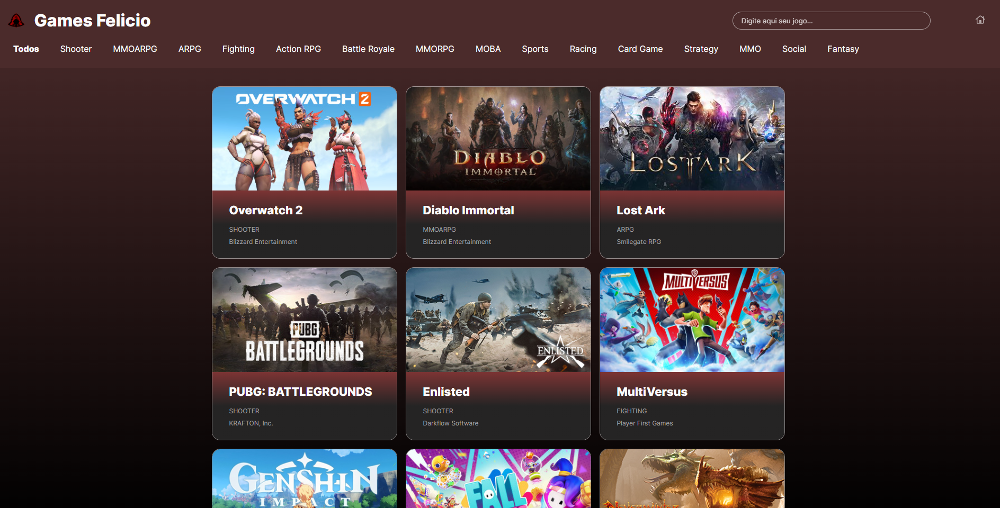
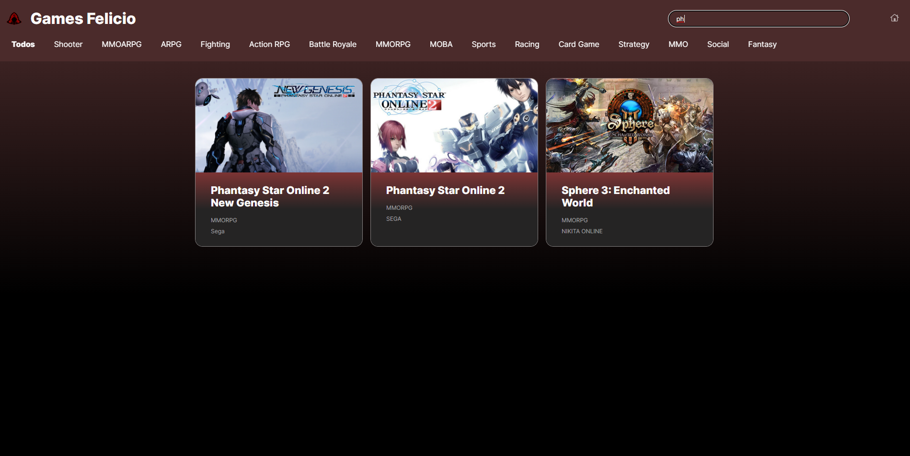

<div align="center" id="top"> 
  

&#xa0;

<a href="https://felicio-games.vercel.app/">Site</a>

</div>

<h1 align="center">Felicio Games</h1>

<p align="center">
  

  

  

</p>

<p align="center">
  <a href="#dart-about">About</a> &#xa0; | &#xa0; 
  <a href="#sparkles-features">Features</a> &#xa0; | &#xa0;
  <a href="#rocket-technologies">Technologies</a> &#xa0; | &#xa0;
  <a href="#white_check_mark-requirements">Requirements</a> &#xa0; | &#xa0;
  <a href="#checkered_flag-starting">Starting</a> &#xa0; | &#xa0;
  <a href="https://github.com/felicio-almd" target="_blank">Author</a>
</p>

<br>

## :dart: About

Site de uma Lista de jogos, fornecida por um API, realizado com HTML, CSS e ReactJS

## :sparkles: Features

:heavy_check_mark: Feature 1: Projeto feito com react;\
:heavy_check_mark: Feature 2: Responsividade para mobile e tablet;\
:heavy_check_mark: Feature 3: Loader quando jogos não apresenta jogos;\
:heavy_check_mark: Feature 4: Apresenta mensagem visiveis ao usuario quando ocorre erro;\
:heavy_check_mark: Feature 5: Campo para pesquisa de jogos por titulo;\
:heavy_check_mark: Feature 6: Labels com os generos de jogos disponiveis;

## :rocket: Technologies

The following tools were used in this project:

- [HTML5](https://developer.mozilla.org/pt-BR/docs/Web/HTML)
- [CSS](https://developer.mozilla.org/pt-BR/docs/Web/CSS)
- [JavaScript](https://developer.mozilla.org/pt-BR/docs/Web/JavaScript)
- [Node.js](https://nodejs.org/en/)
- [React](https://pt-br.reactjs.org/)

Prints do site :



## :white_check_mark: Requirements

Before starting :checkered_flag:, you need to have [Git](https://git-scm.com) and [Node](https://nodejs.org/en/) installed.

## :checkered_flag: Starting

```bash
# Clone this project
$ git clone https://github.com/felicio-almd/felicio-games

# Access
$ cd felicio-games

# Install dependencies
$ npm install

# Run the project
$ npm run dev

# The server will initialize in the <http://localhost:3000>
```

<!-- ## :memo: License

This project is under license from MIT. For more details, see the [LICENSE](LICENSE.md) file. -->

Made with :heart: by <a href="https://github.com/{{YOUR_GITHUB_USERNAME}}" target="_blank">Felicio Almeida</a>

&#xa0;

<a href="#top">Back to top</a>
